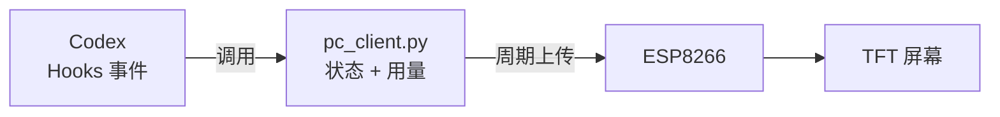
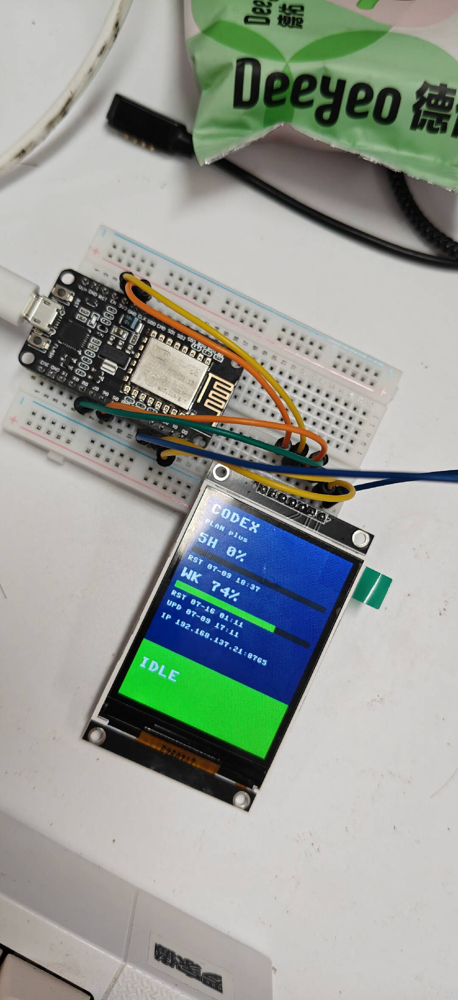

# CodexExtraLight

用 ESP8266 + SPI TFT 屏幕显示 Codex 实时状态和用量。





## 你需要准备

| 材料 | 说明 |
|------|------|
| ESP8266 NodeMCU | 一块 |
| 2.4 寸 SPI TFT 屏幕 | 240×320，ILI9341 驱动 |
| 杜邦线 | 8 根母对母 |
| Micro USB 数据线 | 连接电脑和 ESP |

## 接线

屏幕引脚 → NodeMCU 引脚：

| TFT 屏幕 | NodeMCU |
|----------|---------|
| GND | GND |
| VCC | 3V3 |
| SCK | D5 (GPIO14) |
| SDA | D7 (GPIO13) |
| RST | D1 (GPIO5) |
| DC | D2 (GPIO4) |
| CS | D3 (GPIO0) |

> `SDA` 就是屏幕的 MOSI 数据输入，这个屏幕不接 MISO。

## 烧录和部署

通过 Codex 内置的 `esp-serial-port` 技能完成所有 ESP 操作，不需要手动敲命令。

### 1. 刷 MicroPython 固件

对 Codex 说：

> 帮我把 `asserts/ESP8266_GENERIC-20260406-v1.28.0.bin` 刷到 ESP8266 上

技能会自动扫描 COM 端口、擦除 Flash、写入固件。

### 2. 上传程序

对 Codex 说：

> 帮我把 esp/ 目录的所有文件部署到 ESP8266

技能会依次上传 `config.py`、`tft_display.py`、`wifi_setup.py`、`codex_screen.py`、`captive_dns.py`，最后上传 `main.py` 触发重启。

### 3. 配网

首次启动或 WiFi 连接失败时，ESP 会开启 `Codex-Setup-xxxxxx` 热点：

1. 手机或电脑连接这个热点
2. 通常会自动弹出配网页面，没弹出就打开 `http://192.168.4.1/`
3. 选 WiFi 输入密码，保存
4. ESP 自动重启，屏幕显示 IP 地址

### 4. 修改配置（可选）

如需切换屏幕驱动，编辑 `esp/config.py`：

- `TFT_DRIVER`：默认 `ili9341`，黑屏或花屏换 `st7789`
- `SETUP_AP_PASSWORD`：配网热点密码，默认 `codex8266`

改后重新上传即可。

## 电脑端

### 启动客户端

```powershell
python pc_client.py
```

GUI 窗口点 ▶ Start 开始轮询，点 ⚙ 设置 ESP 的 IP 地址和轮询间隔。

关闭窗口会自动隐藏到系统托盘，右键托盘图标可彻底退出。

### 对接 Codex Hooks

编辑 `C:\Users\<你的用户名>\.codex\hooks.json`，添加以下配置：

```json
{
  "hooks": {
    "UserPromptSubmit": [
      { "hooks": [{ "type": "command", "command": "python \"<项目路径>/pc_client.py\" UserPromptSubmit", "timeout": 2 }] }
    ],
    "PreToolUse": [
      { "hooks": [{ "type": "command", "command": "python \"<项目路径>/pc_client.py\" PreToolUse", "timeout": 2 }] }
    ],
    "PostToolUse": [
      { "hooks": [{ "type": "command", "command": "python \"<项目路径>/pc_client.py\" PostToolUse", "timeout": 2 }] }
    ],
    "PermissionRequest": [
      { "hooks": [{ "type": "command", "command": "python \"<项目路径>/pc_client.py\" PermissionRequest", "timeout": 2 }] }
    ],
    "Stop": [
      { "hooks": [{ "type": "command", "command": "python \"<项目路径>/pc_client.py\" Stop", "timeout": 2 }] }
    ]
  }
}
```

> `<项目路径>` 换成你的实际路径，比如 `D:/我的开源/codex-extra-light`。

### 事件说明

| 事件 | 屏幕显示 |
|------|----------|
| `UserPromptSubmit`、`PreToolUse`、`PostToolUse` | 红色块闪烁 — 工作中 |
| `PermissionRequest` | 黄色块常亮 — 等待确认 |
| `Stop` | 绿色块常亮 — 空闲 |

## 打包为 EXE

```powershell
.\build.bat
```

会在 `dist/` 目录生成 `CodexExtraLight.exe`，可直接运行，不依赖 Python 环境。
