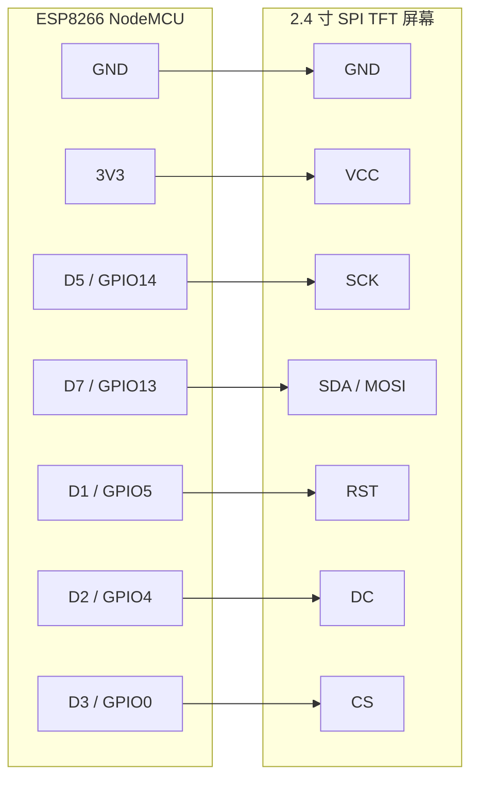

# ESP8266 Codex 状态屏固件

把 `config.py`、`tft_display.py`、`wifi_setup.py`、`codex_screen.py`、`main.py` 上传到 ESP8266 的 MicroPython 文件系统。

先编辑 `config.py`：

- `TFT_DRIVER`：默认先用 `st7789`；如果屏幕黑屏或花屏，再尝试 `ili9341`。
- `SETUP_AP_PASSWORD`：ESP 配网热点密码，默认 `codex8266`。

首次启动或 WiFi 连接失败时，ESP 会开启 `Codex-Setup-xxxxxx` 热点：

1. 用手机或电脑连接这个热点。
2. 系统通常会自动弹出 WiFi 登录/配网页面；如果没有弹出，手动打开 `http://192.168.4.1/`。
3. 从下拉框选择要连接的 WiFi；如果列表不全，点击刷新按钮重新扫描，隐藏网络可以手动填写。
4. 保存后 ESP 会把 WiFi 配置保存到板上的 `wifi_config.json`，然后自动重启并尝试连接目标 WiFi。

配网阶段屏幕只显示热点名称、热点密码和配网页面地址；如果已有 WiFi 配置，会先显示目标 SSID 和 30 秒连接倒计时。ESP 连上目标 WiFi 后才切换到 Codex 状态屏。

默认 NodeMCU 接线：

- TFT `GND` -> `GND`
- TFT `VCC` -> `3V3`
- TFT `SCK` -> `D5 / GPIO14`
- TFT `SDA` -> `D7 / GPIO13`
- TFT `RST` -> `D1 / GPIO5`
- TFT `DC` -> `D2 / GPIO4`
- TFT `CS` -> `D3 / GPIO0`

接线方向按“屏幕引脚接到 NodeMCU 引脚”理解。`SDA` 是屏幕 SPI 数据输入，等价于 `MOSI`；这个屏幕没有接 `MISO`。

ESP 成功连接 WiFi 后，从串口输出或屏幕读取 IP 地址。然后在项目根目录复制
`pc_client_config.example.json` 为 `pc_client_config.json`，并把 `esp_host`
改成这个 IP。
