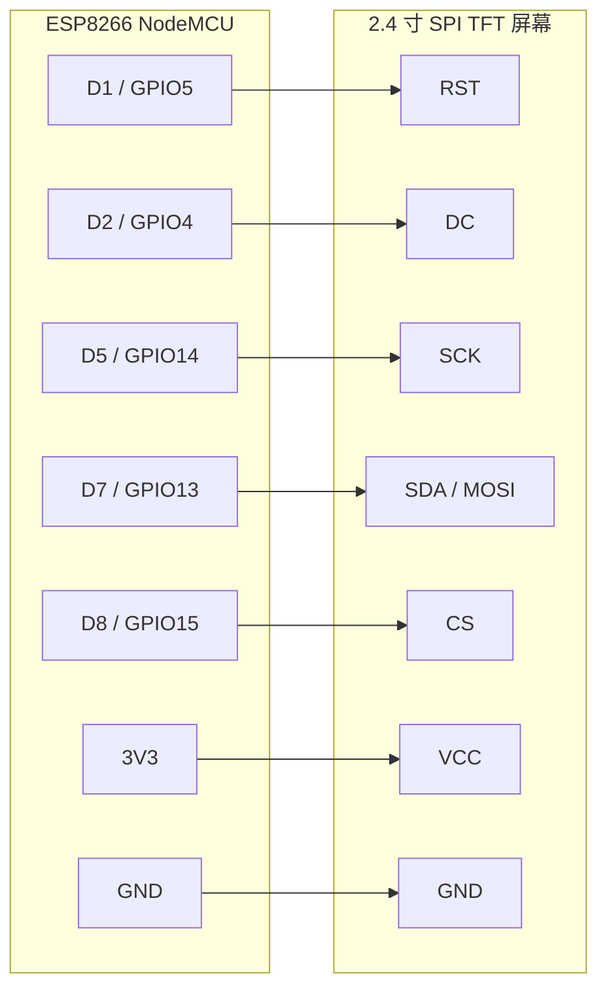

# ESP8266 Codex 状态屏固件

把 `config.py`、`tft_display.py`、`main.py` 上传到 ESP8266 的 MicroPython 文件系统。

先编辑 `config.py`：

- `WIFI_SSID`
- `WIFI_PASSWORD`
- `TFT_DRIVER`：默认先用 `st7789`；如果屏幕黑屏或花屏，再尝试 `ili9341`。

默认 NodeMCU 接线：

- TFT `SCK` -> `D5 / GPIO14`
- TFT `SDA` -> `D7 / GPIO13`
- TFT `CS` -> `D8 / GPIO15`
- TFT `DC` -> `D2 / GPIO4`
- TFT `RST` -> `D1 / GPIO5`
- TFT `VCC` -> `3V3`
- TFT `GND` -> `GND`

接线方向按“屏幕引脚接到 NodeMCU 引脚”理解。`SDA` 是屏幕 SPI 数据输入，等价于 `MOSI`；这个屏幕没有接 `MISO`。

ESP 启动后，从串口输出读取 IP 地址。然后在项目根目录复制
`pc_client_config.example.json` 为 `pc_client_config.json`，并把 `esp_host`
改成这个 IP。
